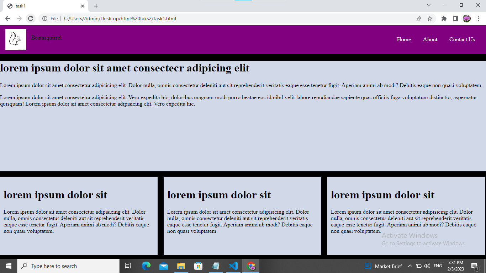
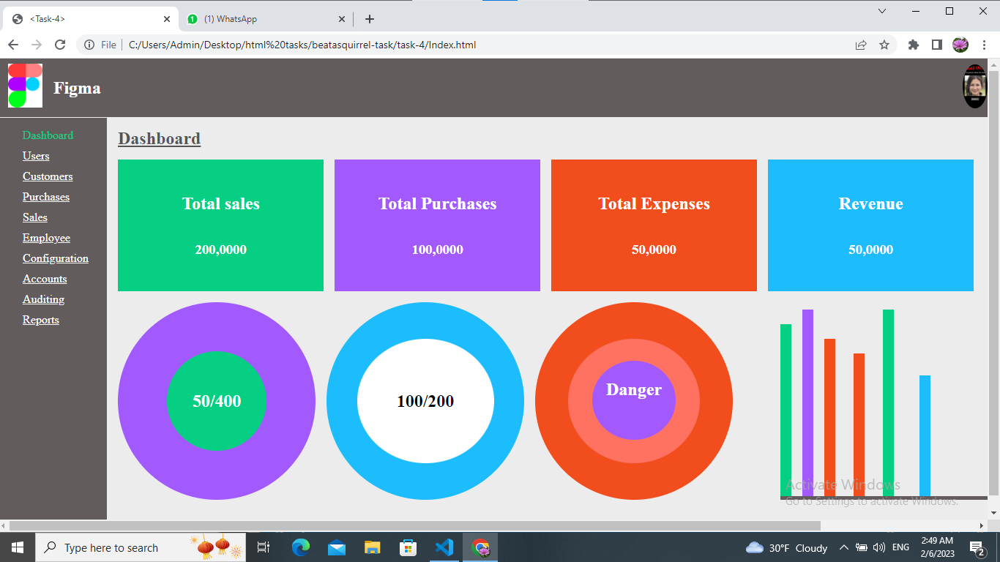

## Betasquirrel-tasks

Assignments from betasquirrel

## Outputs

|Requirments                                  |Output
|--------------------------------------------|----------------------------------------|
||     |
| |     |
||
# _Importent notes_

# HTML Introduction    

HTML stands for Hyper Text Markup Language.
HTML is the standard markup language for creating Web pages.
HTML describes the structure of a Web page.
HTML consists of a series of elements.
HTML elements tell the browser how to display the content.

## task-3

Read the below pages and attend the tests.

- [HTML](https://www.w3schoools.com/html/default.asp)

- [Attributes](https://www.w3schools.com/html/html_attributes.asp)

- [Style](https://www.w3schools.com/html/html_styles.asp)

- [heddings](https://www.w3schools.com/html/html_headings.asp)

- [Paragraphs](https://www.w3schools.com/html/html_paragraphs.asp)

- [Heddings](https://www.w3schoool.com/html-heddings.asp)

- [Formatting](https://www.w3schools.com/html/html_formatting.asp)

- [color](https://www.w3schools.com/html/html_colors.asp)

- [css](https://www.w3schools.com/html/html_css.asp)

- [links](https://www.w3schoool.com/html-links.asp)

- [Images](https://www.w3schoool.com/html-images.asp)

- [Block&inline](https://www.w3schools.com/html/html_blocks.asp)

- [classes](https://www.w3schools.com/html/html_classes.asp)

- [Id](https://www.w3schools.com/html/html_id.asp)

- [Layout](https://www.w3schools.com/html/html_layout.asp)

- [File paths](https://www.w3schools.com/html/html_filepaths.asp)

- [Head](https://www.w3schools.com/html/html_head.asp)

- [Quotations](https://www.w3schools.com/html/html_quotation_elements.asp)

- [comments](https://www.w3schools.com/html/html_comments.asp)

- [Responsive](https://www.w3schools.com/html/html_responsive.asp)

# HTML TABLES

- [Tables](https://www.w3schools.com/html/html_tables.asp)

- [tables Borders](https://www.w3schools.com/html/html_table_borders.asp)

- [Table Sizes](https://www.w3schools.com/html/html_table_sizes.asp)

- [Table Headers](https://www.w3schools.com/html/html_table_headers.asp)

- [Padding&Spacing](https://www.w3schools.com/html/html_table_padding_spacing.asp)

- [Colspan&Rowspan](https://www.w3schools.com/html/html_table_colspan_rowspan.asp)

- [Table Styling](https://www.w3schools.com/html/html_table_styling.asp)

- [Table Colgroup](https://www.w3schools.com/html/html_table_colgroup.asp)

# HTML FORMS

- [HTML Forms](https://www.w3schools.com/html/html_forms.asp)

- [Form Attributtes](https://www.w3schools.com/html/html_forms_attributes.asp)

- [Form Elements](https://www.w3schools.com/html/html_form_elements.asp)

- [Input Types](https://www.w3schools.com/html/html_form_input_types.asp)

- [Input Attributes](https://www.w3schools.com/html/html_form_attributes.asp)

- [Input Form Attributes](https://www.w3schools.com/html/html_form_attributes_form.asp)

## Linux Commands

- `cd` - Change current directory.Ex:`cd Desktop`, `cd..`

- `ls` -List contents of a directory,Ex: `ls -a` lists hidden files as well.

- `pwd` -Display current working directory path

- `cat` -Display contents of a file.Ex:'cat README.md'

- `mkdir` -make new folder.Ex:`mkdir betasquirrel-task`

## Git Commands

- `git` config confiqure g user.Ex`git config --global user.name "RUKSANAPABDULKADER",git config user.email"ruksanapabdulkader@gmail.com"`

- `git clone` clone a remote git repo to your local.Ex:`git clone https://github.com/ruksanapabdulkader/betasquirrel-tasks.git`

- `git add `addyour file changes to git. Ex:`git add .,git add README.md`

- `git commit` Commit changes to git. Ex:`git commit -m "Initial commit"

- `git push` push your local commits to remote repo Ex:`git push origin main`

- `git stash` This command can be used when we want to save our work without staging or committing the code to our Git repository and want to switch between branches.

- `git pull` The git pull command first runs ‘git fetch’ which downloads the content from the specified remote repository and then immediately updates the local repo to match the content.

- `git diff` Diffing is a function that takes two input datasets and outputs the changes between them. The git diff command is a multi-use Git command which, when executed, runs a diff function on Git data sources. These data sources can be commits, branches, files, and more. The git diff command is often used along with the git status and git log commands to analyze the current state of our Git repository. We use `git log` to get the details of commit IDs

## _This is my website live link_

 https://ruksanapabdulkader.github.io/betasquirrel-tasks/

## _This is my linkedin  prifile URL:_

www.linkedin.com/in/ruksana-p-abdulkader-04507b209

## _My Stack overflow profile URL:_
https://stackoverflow.com/users/21194413/ruksana-p-abdulkader

# Java script

- [JS introduction](https://www.w3schools.com/js/js_intro.asp)

- [Where to](https://www.w3schools.com/js/js_whereto.asp)

- [Output](https://www.w3schools.com/js/js_output.asp)

- [JS Statements](https://www.w3schools.com/js/js_statements.asp)

- [JS Syntax](https://www.w3schools.com/js/js_syntax.asp)

- [JS Comments](https://www.w3schools.com/js/js_comments.asp)

- [JS variable](https://www.w3schools.com/js/js_variables.asp)

- [JS let](https://www.w3schools.com/js/js_let.asp)

- [JS const](https://www.w3schools.com/js/js_const.asp)

- [JS operator](https://www.w3schools.com/js/js_operators.asp)

- [JS arithemetic](https://www.w3schools.com/js/js_arithmetic.asp)

- [JS Assignment](https://www.w3schools.com/js/js_assignment.asp)

- [JS data types](https://www.w3schools.com/js/js_datatypes.asp)

- [JS function](https://www.w3schools.com/js/js_functions.asp)

- [JS Objects](https://www.w3schools.com/js/js_objects.asp)

- [JS events](https://www.w3schools.com/js/js_events.asp)

- [JS strings](https://www.w3schools.com/js/js_strings.asp)

- [JS String-methods](https://www.w3schools.com/js/js_string_methods.asp)

- [JS string-search](https://www.w3schools.com/js/js_string_search.asp)

- [JS String-templates](https://www.w3schools.com/js/js_string_templates.asp)

- [JS numbers](https://www.w3schools.com/js/js_numbers.asp)

- [JS bigint](https://www.w3schools.com/js/js_bigint.asp)

- [JS number-metods](https://www.w3schools.com/js/js_number_methods.asp)

- [JS number-properties](https://www.w3schools.com/js/js_number_properties.asp)

- [JS arrays](https://www.w3schools.com/js/js_arrays.asp)

- [JS array methods](https://www.w3schools.com/js/js_array_methods.asp)

- [JS array sort](https://www.w3schools.com/js/js_array_sort.asp)

- [JS array-iteration](https://www.w3schools.com/js/js_array_iteration.asp)

- [JS array-const](https://www.w3schools.com/js/js_array_const.asp)

# JS Function

- [Function definition](https://www.w3schools.com/js/js_function_definition.asp)

- [Function parameters](https://www.w3schools.com/js/js_function_parameters.asp)

- [Function invocation](https://www.w3schools.com/js/js_function_invocation.asp)

- [Function call](https://www.w3schools.com/js/js_function_call.asp)

- [Function apply](https://www.w3schools.com/js/js_function_apply.asp)

- [Function bind](https://www.w3schools.com/js/js_function_bind.asp)

- [Function closures](https://www.w3schools.com/js/js_function_closures.asp)

