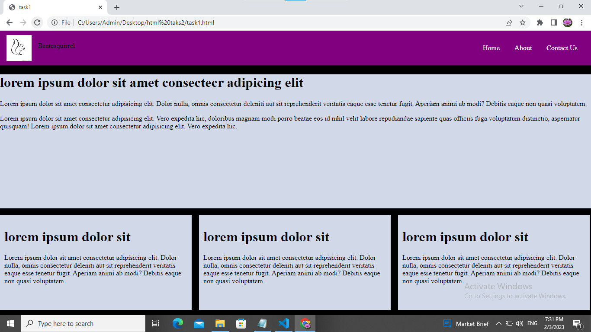
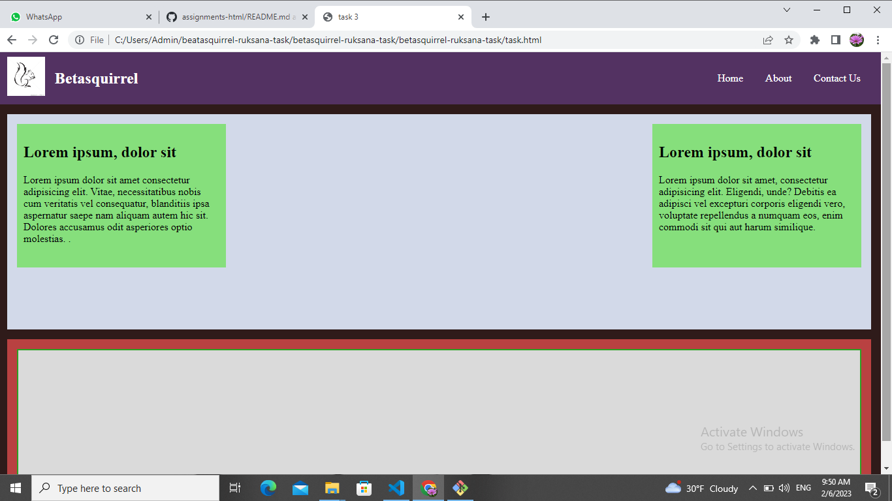
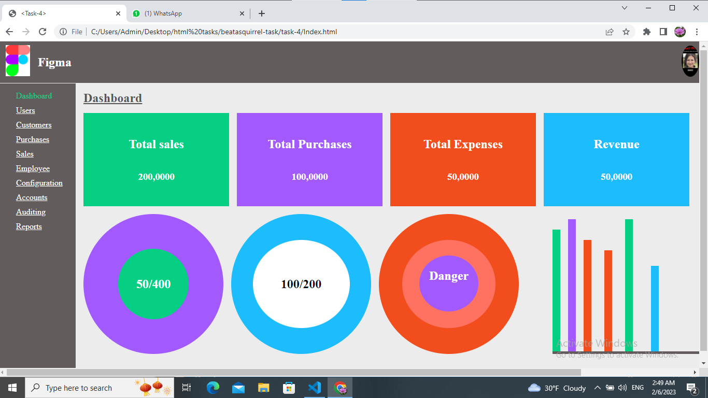

## Betasquirrel-tasks

Assignments from betasquirrel

## Outputs

| Outputs                             |
| ----------------------------------- |
|  |
|  |
|  |

# _Importent notes_

# HTML Introduction

HTML stands for Hyper Text Markup Language.
HTML is the standard markup language for creating Web pages.
HTML describes the structure of a Web page.
HTML consists of a series of elements.
HTML elements tell the browser how to display the content.

## task-3

Read the below pages and attend the tests.

- [HTML](https://www.w3schoools.com/html/default.asp)

- [Attributes](https://www.w3schools.com/html/html_attributes.asp)

- [Style](https://www.w3schools.com/html/html_styles.asp)

- [heddings](https://www.w3schools.com/html/html_headings.asp)

- [Paragraphs](https://www.w3schools.com/html/html_paragraphs.asp)

- [Heddings](https://www.w3schoool.com/html-heddings.asp)

- [Formatting](https://www.w3schools.com/html/html_formatting.asp)

- [color](https://www.w3schools.com/html/html_colors.asp)

- [css](https://www.w3schools.com/html/html_css.asp)

- [links](https://www.w3schoool.com/html-links.asp)

- [Images](https://www.w3schoool.com/html-images.asp)

- [Block&inline](https://www.w3schools.com/html/html_blocks.asp)

- [classes](https://www.w3schools.com/html/html_classes.asp)

- [Id](https://www.w3schools.com/html/html_id.asp)

- [Layout](https://www.w3schools.com/html/html_layout.asp)

- [File paths](https://www.w3schools.com/html/html_filepaths.asp)

- [Head](https://www.w3schools.com/html/html_head.asp)

- [Quotations](https://www.w3schools.com/html/html_quotation_elements.asp)

- [comments](https://www.w3schools.com/html/html_comments.asp)

- [Responsive](https://www.w3schools.com/html/html_responsive.asp)

## Linux Commands

- `cd` - Change current directory.Ex:`cd Desktop`, `cd..`

- `ls` -List contents of a directory,Ex: `ls -a` lists hidden files as well.

- `pwd` -Display current working directory path

- `cat` -Display contents of a file.Ex:'cat README.md'

- `mkdir` -make new folder.Ex:`mkdir betasquirrel-task`

## Git Commands

- `git` config confiqure g user.Ex`git config --global user.name "RUKSANAPABDULKADER",git config user.email"ruksanapabdulkader@gmail.com"`

- `git clone` clone a remote git repo to your local.Ex:`git clone https://github.com/ruksanapabdulkader/betasquirrel-tasks.git`

- `git add `addyour file changes to git. Ex:`git add .,git add README.md`

- `git commit` Commit changes to git. Ex:`git commit -m "Initial commit"

- `git push` push your local commits to remote repo Ex:`git push origin main`

## _This is my website live link_

 https://ruksanapabdulkader.github.io/betasquirrel-tasks/
